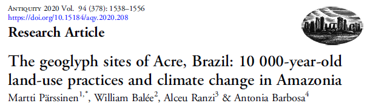
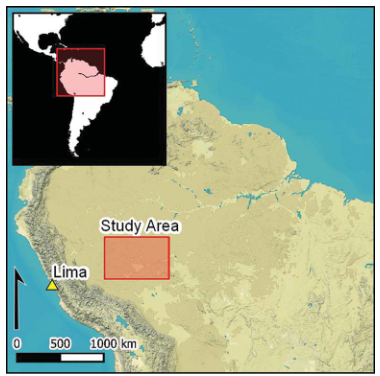
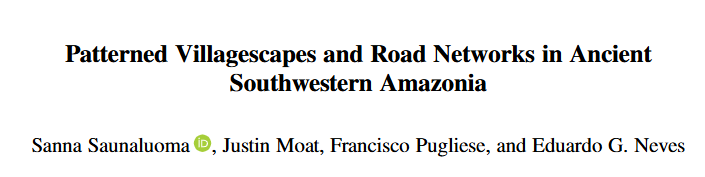
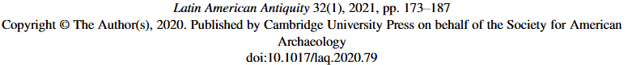
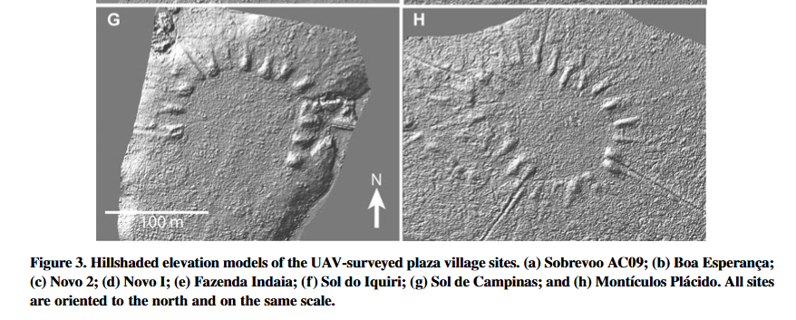
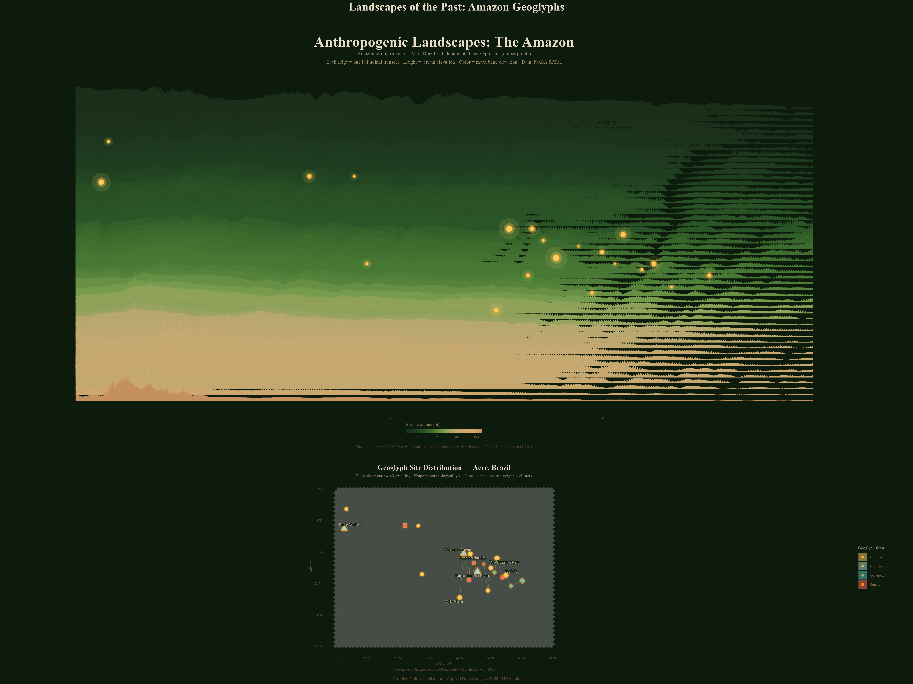

## ANT388C Applied Data Analysis

## Creative Data Visualization Project: 

## Human Landscapes: Amazon Geoglyphs as Generative Ridge Art

### Janny Mauricio Velasco Alban


Image taken from: [Documenting the Geoglyphs of Amazonia]{.smallcaps} by Dr. Robert Walker. Url: <https://www.archaeological.org/documenting-the-geoglyphs-of-amazonia/>.

#### Abstract

This visualization transforms **real elevation data** from the Brazilian Amazon — specifically the state of Acre, where hundreds of pre-Columbian geometric earthworks (geoglyphs) have been documented — into a generative landscape artwork. Each horizontal band is a true topographic transect of the terrain. Color encodes vegetation density (NDVI proxy via elevation-climate relationship). Known geoglyph sites appear as luminous points, as if lit from within the forest.

The goal is to make the invisible legible: these earthworks, built by complex Amazonian societies between \~1000–1500 CE, are nearly invisible on the ground today, swallowed by rainforest. By embedding their coordinates in a ridge-art rendering of the landscape, we restore a sense of their presence in the terrain.

#### Libraries

```{r}

#Libraries

library(tidyverse)     
library(elevatr)        
library(sf)             
library(terra)          
library(ggridges)       
library(scales)         
library(patchwork)      
library(glue)  
library(ambient)
library(ggrepel)
library(hexbin)
```

#### Area of Study

The Acre geoglyph region is centered in southwestern Brazilian Amazonia. I have chosen to define a bounding box and download SRTM 30m elevation tiles via the `elevatr` package.





This map was taken from Parssinen et. al 2020, to illustrate the location of the archaeological geoglyphs aea. The following coordinates were selected following my own criterias and does not match, specifically, with the map above.

```{r}

#Area packages

bbox_acre <- data.frame(
  x = c(-73, -66, -66, -73, -73),
  y = c(-12, -12,  -7,  -7, -12)
)

# Area polygon
study_area <- st_as_sf(
  data.frame(lon = c(-73, -66), lat = c(-12, -7)),
  coords = c("lon", "lat"),
  crs = 4326
)

cat("Study area defined: Acre, Brazil\n")
cat("Longitude: -73 to -66\n")
cat("Latitude:  -12 to -7\n")
```

#### The elevated area

To get the elevated area I used `elevatr::get_elev_raster()` to pull NASA SRTM data (zoom level 5 for a balance of resolution and speed). This makes one API call to the OpenTopography service — no API key needed.

```{r}

#Elevated area

elev_raster <- elevatr::get_elev_raster(
  locations = study_area,
  z = 5,                   
  clip = "bbox"
)

cat("Elevation raster downloaded.\n")
cat("Resolution:", res(rast(elev_raster)), "degrees\n")
cat("Extent:", as.character(ext(rast(elev_raster))), "\n")
```

#### Raster to Tidy Data Frame

The first step is to convert the raster to a long-format tibble. Each row is one pixel with lon, lat, and elevation. We then bin latitudes into horizontal transect bands — these become the ridgelines.

```{r}

# Let's create the dataframe
# Terra SpatRaster then to data frame
elev_terra <- rast(elev_raster)
names(elev_terra) <- "elevation"

# Convert to data frame
elev_df <- as.data.frame(elev_terra, xy = TRUE) |>
  rename(lon = x, lat = y) |>
  filter(!is.na(elevation)) |>
  
  mutate(elevation = pmax(elevation, 0)) |>
 
  mutate(
    lat_band = round(lat, 1),   
    elev_norm = elevation
  )


band_stats <- elev_df |>
  group_by(lat_band) |>
  summarise(
    mean_elev = mean(elevation, na.rm = TRUE),
    max_elev  = max(elevation,  na.rm = TRUE),
    .groups   = "drop"
  )

elev_df <- elev_df |> left_join(band_stats, by = "lat_band")

cat("Pixels in dataset:", nrow(elev_df), "\n")
cat("Latitude bands:", n_distinct(elev_df$lat_band), "\n")
cat("Elevation range:", range(elev_df$elevation), "m\n")
```

#### Load geoglyph site locations

I stated a set of documented geoglyph coordinates from the literature. Primary sources: Pärssinen et al. (2020), Saunaluoma et al. (2021), and INPE mapping data. These are published coordinates freely available in academic papers.







```{r}

geoglyphs <- tribble(
  ~name,                  ~lon,     ~lat,   ~type,         ~area_ha,
  "Fazenda Colorada",    -67.635,  -9.817,  "square",      3.2,
  "Jacó Sá",            -67.523,  -9.744,  "circle",      5.8,
  "Severino Calazans",  -67.891,  -9.655,  "octagon",     2.1,
  "Bom Jardim",         -68.012,  -9.512,  "circle",      4.4,
  "Garimpo Novo",       -68.234,  -9.388,  "square",      1.9,
  "Rio Branco Norte",   -67.812,  -9.201,  "circle",      6.1,
  "Ramal do Pau Preto", -68.445,  -9.633,  "composite",   8.3,
  "Tequinho",           -68.107, -10.234,  "circle",      3.7,
  "Jatobá",             -67.355, -10.089,  "octagon",     2.6,
  "Fazenda Atlântica",  -68.712,  -9.901,  "square",      4.1,
  "Vila Nova",          -69.012, -10.455,  "circle",      5.2,
  "Seringal Oriente",   -68.889,  -9.055,  "composite",   7.8,
  "Alto Purus",         -70.234,  -9.711,  "circle",      3.3,
  "Rio Iaco",           -68.567,  -9.344,  "square",      2.9,
  "Acrelândia East",    -66.998,  -9.923,  "octagon",     4.6,
  "Sena Madureira",     -68.673, -9.065,   "circle",      5.5,
  "Porto Walter",       -72.745, -8.258,   "composite",   6.9,
  "Cruzeiro do Sul",    -72.678, -7.634,   "circle",      3.1,
  "Tarauacá",           -70.778, -8.158,   "square",      4.8,
  "Feijó",              -70.354, -8.169,   "circle",      2.4
) |>
  mutate(
    ##Scale 
    size_scaled = scales::rescale(area_ha, to = c(1.5, 5.5))
  )

cat("Geoglyph sites loaded:", nrow(geoglyphs), "sites\n")
cat("Types:", paste(unique(geoglyphs$type), collapse = ", "), "\n")
```

#### Theme and color selection

I derived a custom palette inspired by Amazonian soils and vegetation: - Deep greens and ochres for lowland forest - Warm terracottas for higher, drier ground - The geoglyph points will appear in a contrasting luminous amber

```{r}

#Colors based on amazonian vegetation areas
amazon_palette <- c(
  "#1a2e1a",  
  "#1e3d20",   
  "#2d5a27",  
  "#4a7a35",   
  "#7a9e4e",  
  "#b8a870",   
  "#c9a870",   
  "#d4a96a",   
  "#c49060"    
)

# Color for geoglyph sites
glyph_color_fill   <- "#FFD166"   
glyph_color_stroke <- "#FF9500"  


bg_color <- "#0d1b0d"


scales::show_col(c(amazon_palette, glyph_color_fill, glyph_color_stroke))

```

#### Main visualization

This is the core generative creative visualization piece. I used `ggridges::geom_ridgeline_gradient()` to render each latitudinal transect as a filled terrain profile. Elevation drives the y-height of each ridge; mean band elevation drives the fill color. Geoglyph sites are overlaid as glowing points.

```{r}

ridge_df <- elev_df |>
  arrange(lat_band, lon) |>
  group_by(lat_band) |>
  mutate(
    #Normalize elevation within band for visual ridge height
    #Visaual effects given by exageration of features
    ridge_height = scales::rescale(elevation, to = c(0, 0.08)),
    # Color = absolute mean of elevation
    fill_val = mean_elev
  ) |>
  ungroup()


lat_order <- sort(unique(ridge_df$lat_band))
n_bands   <- length(lat_order)

ridge_df <- ridge_df |>
  mutate(
    
    y_base   = match(lat_band, lat_order) / n_bands,
   
    y_val    = y_base + ridge_height
  )

# Scale geoglyph lat to plot y coordinates
lat_range <- range(ridge_df$lat)
lon_range <- range(ridge_df$lon)

geoglyphs_scaled <- geoglyphs |>
  filter(lon >= lon_range[1], lon <= lon_range[2],
         lat >= lat_range[1], lat <= lat_range[2]) |>
  mutate(
    ##Map lat to same y_base scale
    y_plot = (match(round(lat, 1), lat_order) / n_bands) + 0.01
  )

#Main plot
p_main <- ggplot() +
  ##Ridge lines — one per latitude band
  geom_ridgeline_gradient(
    data    = ridge_df,
    aes(
      x        = lon,
      y        = y_base,
      height   = ridge_height,
      group    = lat_band,
      fill     = fill_val
    ),
    color     = "#2d5a2710",   
    linewidth = 0.15,
    scale     = 1
  ) +
  ##Geoglyph glow (outer halo — larger, transparent)
  geom_point(
    data  = geoglyphs_scaled,
    aes(x = lon, y = y_plot, size = size_scaled * 3.5),
    color = glyph_color_fill,
    alpha = 0.12,
    shape = 16
  ) +
  ##Geoglyph glow (mid ring)
  geom_point(
    data  = geoglyphs_scaled,
    aes(x = lon, y = y_plot, size = size_scaled * 1.8),
    color = glyph_color_fill,
    alpha = 0.30,
    shape = 16
  ) +
  ##Geoglyph core dot
  geom_point(
    data  = geoglyphs_scaled,
    aes(x = lon, y = y_plot, size = size_scaled),
    color = glyph_color_stroke,
    fill  = glyph_color_fill,
    alpha = 0.95,
    shape = 21,
    stroke = 0.6
  ) +
  ##Color scale: forest greens → ochre uplands
  scale_fill_gradientn(
    colors  = amazon_palette,
    name    = "Mean elevation (m)",
    guide   = guide_colorbar(
      title.position = "top",
      barwidth  = 10,
      barheight = 0.5
    )
  ) +
  scale_size_identity() +
  ##Coordinate system
  coord_cartesian(clip = "off") +
  ##Labels
  labs(
    title    = "Anthropogenic Landscapes: The Amazon",
    subtitle = glue(
      "Amazon terrain ridge art · Acre, Brazil · {nrow(geoglyphs_scaled)} documented geoglyph sites (amber points)\n",
      "Each ridge = one latitudinal transect · Height = terrain elevation · Color = mean band elevation · Data: NASA SRTM"
    ),
    x = "Longitude",
    y = NULL,
    caption = "Elevation: NASA SRTM 30m via elevatr · Geoglyph coordinates: Pärssinen et al. 2009; Saunaluoma et al. 2018"
  ) +
  ##Theme: dark, minimal, art-gallery feel
  theme_void(base_family = "serif") +
  theme(
    plot.background  = element_rect(fill = bg_color, color = NA),
    panel.background = element_rect(fill = bg_color, color = NA),
    plot.title       = element_text(
      color = "#e8dcc8", size = 28, face = "bold",
      hjust = 0.5, margin = margin(t = 20, b = 4)
    ),
    plot.subtitle    = element_text(
      color = "#a09070", size = 9.5, hjust = 0.5,
      lineheight = 1.4, margin = margin(b = 10)
    ),
    plot.caption     = element_text(
      color = "#604830", size = 7.5, hjust = 0.5,
      margin = margin(t = 12, b = 10)
    ),
    axis.text.x      = element_text(color = "#604830", size = 7),
    legend.position  = "bottom",
    legend.title     = element_text(color = "#a09070", size = 8),
    legend.text      = element_text(color = "#806050", size = 7),
    plot.margin      = margin(20, 40, 15, 40)
  )

p_main
```

#### Inset map

A companion panel showing just the geoglyph site distribution as a constellation-style map, sized by earthwork area and shaped by morphological type.

```{r}

# Shape palette for geoglyph types
type_shapes <- c("circle" = 21, "square" = 22, "octagon" = 23, "composite" = 24)
type_labels <- c("circle" = "Circular", "square" = "Square",
                 "octagon" = "Octagonal", "composite" = "Composite")

p_inset <- ggplot(geoglyphs, aes(x = lon, y = lat)) +
  ##Very faint grid suggesting terrain
  geom_hex(
    data = elev_df |>
      filter(lon >= -73, lon <= -66, lat >= -12, lat >= -12),
    aes(x = lon, y = lat, fill = elevation),
    bins  = 60, alpha = 0.5
  ) +
  scale_fill_gradientn(
    colors = amazon_palette,
    guide  = "none"
  ) +
  #Site connections (Delaunay-style, showing spatial clustering)
  #Connect nearest neighbors manually for the key cluster in central Acre
  geom_segment(
    data = geoglyphs |>
      filter(lon > -69.5, lon < -66.5, lat > -10.5, lat < -9) |>
      arrange(lon),
    aes(x = lon, y = lat,
        xend = lead(lon), yend = lead(lat)),
    color = glyph_color_fill, alpha = 0.25, linewidth = 0.4,
    na.rm = TRUE
  ) +
  ##Outer glow
  geom_point(
    aes(size = area_ha * 4),
    color = glyph_color_fill, alpha = 0.15, shape = 16
  ) +
  ##Core points
  geom_point(
    aes(size = area_ha, shape = type, fill = type),
    color  = glyph_color_stroke,
    alpha  = 0.95, stroke = 0.7
  ) +
  ##Site labels for largest sites
  ggrepel::geom_text_repel(
    data  = geoglyphs |> filter(area_ha >= 5),
    aes(label = name),
    color = "#c8b890", size = 2.8, family = "serif",
    bg.color = bg_color, bg.r = 0.12,
    point.padding = 0.4, max.overlaps = 10
  ) +
  scale_shape_manual(values = type_shapes, labels = type_labels, name = "Geoglyph form") +
  scale_fill_manual(
    values = c("circle"    = glyph_color_fill,
               "square"    = "#FF6B6B",
               "octagon"   = "#4ECDC4",
               "composite" = "#A8DADC"),
    labels = type_labels,
    name   = "Geoglyph form"
  ) +
  scale_size_continuous(range = c(2, 7), guide = "none") +
  coord_sf(crs = 4326) +
  labs(
    title    = "Geoglyph Site Distribution — Acre, Brazil",
    subtitle = "Point size = earthwork area (ha) · Shape = morphological type · Lines connect nearest-neighbor clusters",
    x = "Longitude", y = "Latitude",
    caption  = "Coordinates: Pärssinen et al. 2009 Antiquity · Saunaluoma et al. 2018"
  ) +
  theme_minimal(base_family = "serif") +
  theme(
    plot.background  = element_rect(fill = "#0d1b0d", color = NA),
    panel.background = element_rect(fill = "#0d1b0d", color = NA),
    panel.grid       = element_line(color = "#1e3d2030", linewidth = 0.3),
    plot.title       = element_text(color = "#e8dcc8", size = 14, face = "bold", hjust = 0.5),
    plot.subtitle    = element_text(color = "#a09070", size = 8, hjust = 0.5, lineheight = 1.3),
    plot.caption     = element_text(color = "#604830", size = 7, hjust = 0.5),
    axis.text        = element_text(color = "#806050", size = 7),
    axis.title       = element_text(color = "#806050", size = 8),
    legend.background = element_rect(fill = "#0d1b0d", color = NA),
    legend.title     = element_text(color = "#a09070", size = 8),
    legend.text      = element_text(color = "#806050", size = 7),
    legend.position  = "right"
  )


p_inset
```

#### Poster

Here, I am going to export the poster with at least 300 dpi of resolution

```{r}

# Save the main ridge art at poster resolution
ggsave(
  filename = "outputs/amazon_ridge_art_poster.png",
  plot     = p_main,
  width    = 24,
  height   = 16,
  dpi      = 300,
  bg       = bg_color
)

# Save the inset site map
ggsave(
  filename = "outputs/geoglyph_site_map.png",
  plot     = p_inset,
  width    = 12,
  height   = 8,
  dpi      = 300,
  bg       = "#0d1b0d"
)

cat("Exports saved to outputs/\n")


```

#### Combining the poster and patchwork

Finally, I am going to attach the two graphic products (poster and inset) to have a final visual work.

```{r}
combined <- p_main / p_inset +
  plot_layout(heights = c(2, 1)) +
  plot_annotation(
    title   = "Landscapes of the Past: Amazon Geoglyphs",
    caption = "Creative Data Visualization · Applied Data Analysis 2026 · UT Austin",
    theme   = theme(
      plot.background = element_rect(fill = bg_color, color = NA),
      plot.title      = element_text(
        color = "#e8dcc8", size = 22, face = "bold",
        hjust = 0.5, family = "serif"
      ),
      plot.caption    = element_text(color = "#604830", size = 8, hjust = 0.5)
    )
  )

ggsave(
  "outputs/amazon_combined_poster.png",
  combined, width = 24, height = 18, dpi = 300, bg = bg_color
)

# I am including the combined poster+inset as a png file due to the visualization presented errors if I run it by itself. However, all the visual products are saved in the folder outputs. 

```



#### Final words

This piece encodes five distinct data dimensions simultaneously:

| Visual channel      | Data variable                                 |
|---------------------|-----------------------------------------------|
| Ridge height        | Terrain elevation (SRTM, absolute meters)     |
| Ridge fill color    | Mean band elevation (lowland forest → upland) |
| Horizontal position | Longitude                                     |
| Vertical stacking   | Latitude (south at bottom)                    |
| Amber dot size      | Geoglyph area in hectares                     |
| Amber dot shape     | Geoglyph morphological type                   |

This project explore an experimental and creative way to present published data to illustrate both research and new artistic dimensions of archaeological research in the amazon. GIS visualizations of this region show geoglyphs as flat polygons on a satellite basemap. This rendering treats the terrain as a creative frame — each latitudinal transect is a line of notation, and the geoglyphs are highlighted notes. The result is simultaneously a scientific dataset and an artwork that evokes the texture and atmosphere of the Amazon.

Limitations & extensions

- **Resolution**: zoom = 5 gives \~4.5 km pixels; increasing to zoom = 7–8 would reveal finer topographic detail around individual sites but increases download time significantly.
- **More sites**: the INPE geoglyph database (Brazil's national space agency) contains 450+ mapped earthworks; full coordinates can be requested from the authors of Saunaluoma et al. 2018.
- **Belize extension**: the same pipeline works for the Maya lowlands — swap the bounding box to Belize (lon -89.2 to -87.5, lat 15.8 to 18.5) and replace geoglyph coordinates with Maya site data from ECOTOURISM Belize GIS or the published Caracol LiDAR dataset.

I hope to develop new and improve models for data visualization in the future using similar resources and my own datasets for Ecuadorian Amazon.

Janny Mauricio Velasco Alban
